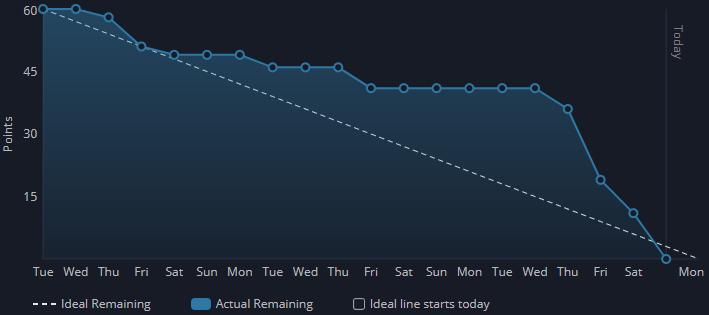

<h1 align="center">
:boar: EQUIPE JAVALI :boar:  

APRENDIZAGEM POR PROJETOS INTEGRADOS  

Sprint 1
</h1>

<h1 align="center"> :keyboard: :keyboard: </h1>

## :mag_right: Índice

    <a href="#objetivo">Objetivo</a> | 
    <a href="#epicos">Épicos</a> |
    <a href="#backlog">Backlog</a> |
    <a href="#dor">DoR</a> |
    <a href="#dod">DoD</a> |
    <a href="#burndown">Burndown</a> |
    <a href="#mvp">MVP</a> 

## :dart: Objetivo da Sprint

    Nesta sprint, a equipe se compromete a entregar o funcionamento inicial do fluxo de usuários e do envio de boletins. Será implementado o cadastro de usuários, autenticação e login, exclusão e listagem de usuários, além da configuração do banco de dados e do envio do boletim automatizado conforme modelo definido. Também será documentado o modelo físico de dados que servirá como base para o desenvolvimento e o protótipo.

## :clipboard: Épicos
Abaixo estão os requisitos abordados nesta sprint:

→ [Voltar ao topo](#topo)

## :bookmark_tabs: Sprint Backlog

Abaixo está o backlog desta sprint:

| Rank | Prioridade |                                                         User Story                                                         | Estimativa | Requisto |                                                                   DoD                                                                   |
|:----:|:----------:|:--------------------------------------------------------------------------------------------------------------------------:|:----------:|:--------:|:---------------------------------------------------------------------------------------------------------------------------------------:|
|  1   |    Alta    |             Como usuário quero receber um boletim sobre as informações do dataset para saber a situação deste.             |     22     |   RF-2   |                     Envio do boletim conforme o modelo enviado, além do envio do boletim para o e-mail do usuário.                      |
|  2   |    Alta    |              Como cliente quero uma tela de cadastro de usuários para ter um controle de quem usa o sistema.               |     5      |   RF-1   |                   Cadastro de usuário com informações de e-mail e senha, além de salvar o usuário no banco de dados.                    |
|  3   |    Alta    | Como administrador quero selecionar os usuários que receberão o boletim automático para controle de acesso de informações. |     5      |   RF-1   |                                      Seleção das permissões de quais usuários receberão o boletim.                                      |
|  4   |    Alta    |       Como desenvolvedor quero um modelo do banco de dados para ter uma noção de comos os dados vão ser organizados.       |     5      |  RNF-5   |                            Deve ser documentado um modelo físico representando entidades e relacionamentos.                             |
|  5   |    Alta    |               Como cliente quero uma lista de usuários e administradores para gerenciar melhor os usuários.                |     4      |   RF-1   |                                                Lista com todos os usuários cadastrados.                                                 |
|  6   |    Alta    |                  Como usuário quero fazer login no sistema para autenticar que eu mesmo estou acessando.                   |     4      |   RF-1   | O login e a autenticação devem estar funcionando corretamente, além de o sistema impedir tentativas de login com credenciais inválidas. |
|  7   |    Alta    |                    Como administrador quero excluir usuário para não dar acesso a pessoas indesejadas.                     |     3      |   RF-1   |                   A UI deve ser atualizada corretamente após a exclusão, refletindo imediatamente no banco de dados.                    |
|  8   |    Alta    |   Como cliente quero que os dados dos usuário sejam salvo em um banco de dados para ter uma armazenamento dos usuários.    |     3      |   RF-1   |             O banco de dados deve estar implementado e configurado corretamente no ambiente de desenvolvimento e produção.              |
|  9   |   Baixa    |                  Como cliente quero uma documentação constante do projeto para melhor compreensão deste.                   |     7      |  RNF-5   |    A documentação deve ser revisada a cada nova atualização do sistema, as quais devem ser comunicadas à equipe de desenvolvimento.     |
|  10  |   Baixa    |                        Como cliente quero um protótipo de projeto para ter uma ideia de com ficará.                        |     6      |  RNF-5   |        Devem ser criados os wireframes das principais telas do sistema, representando fielmente a experiência final do usuário.         |

- Meta da Sprint: 1, 2, 3, 4, 6, 7 e 8	
- Previsão da Sprint: 5, 9, 10

→ [Voltar ao topo](#topo)

## :white_check_mark: DoR - Definition of Ready

    Só poderemos iniciar as tarefas desta sprint caso estejam prontos:

- Arquitetura do projeto  
- Modelo de dados  
- Wireframe  

→ [Voltar ao topo](#topo)  

## :trophy: DoD - Definition of Done
Esta sprint só estará completa quando a equipe concluir:
- O envio do boletim estiver funcionando conforme o modelo definido, enviado corretamente para o e-mail do usuário.
- O cadastro de usuários com e-mail e senha estiver implementado e salvo no banco de dados.
- As permissões de usuários que receberão o boletim forem configuráveis pelo administrador.
- O modelo físico do banco de dados estiver documentado, representando entidades e relacionamentos.
- A listagem de todos os usuários cadastrados estiver disponível.
- O login e a autenticação funcionarem corretamente, impedindo tentativas com credenciais inválidas.
- A exclusão de usuários refletir imediatamente na interface e no banco de dados.
- O banco de dados estiver implementado e configurado corretamente em ambiente de desenvolvimento e produção.

→ [Voltar ao topo](#topo)

## :chart_with_downwards_trend: Burndown da Sprint
Abaixo está o fluxo de entregas desta sprint:

→ [Voltar ao topo](#topo)

## :rocket: MVP - Minimum Viable Product

    O produto mínimo viável desta sprint consiste em um sistema funcional capaz de cadastrar, autenticar, listar e excluir usuários, armazenando todas as informações em um banco de dados devidamente configurado. Além disso, o MVP contempla o envio de boletins automáticos via e-mail, com base em permissões atribuídas aos usuários e seguindo o modelo previamente definido. Para visualizar o que foi desenvolvido no projeto, <a href="https://youtu.be/DA4M8VQmLi8">acesse aqui</a>.

→ [Voltar ao topo](#topo) 
