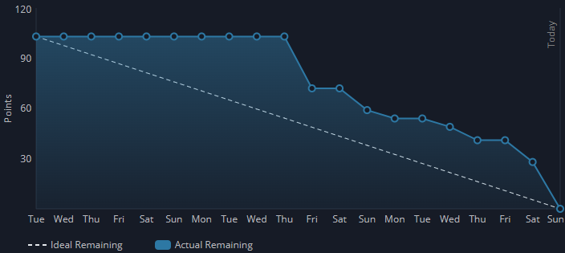

<h1 align="center">
:boar: EQUIPE JAVALI :boar:  

APRENDIZAGEM POR PROJETOS INTEGRADOS  

Sprint 2
</h1>

<h1 align="center"> :keyboard: :keyboard: </h1>

## :mag_right: Índice

    <a href="#objetivo">Objetivo</a> | 
    <a href="#epicos">Épicos</a> |
    <a href="#backlog">Backlog</a> |
    <a href="#dor">DoR</a> |
    <a href="#dod">DoD</a> |
    <a href="#burndown">Burndown</a> |
    <a href="#mvp">MVP</a> 

## :dart: Objetivo da Sprint

    Nesta sprint a equipe se compromete a entregar a versão inicial funcional do chatbot e o envio automático do boletim, implementando um agente capaz de responder exclusivamente a perguntas relacionadas aos datasets, garantindo que todas as conversas sejam salvas no histórico do usuário e que o boletim siga um template padronizado para envio automático.

## :clipboard: Épicos
Abaixo estão os requisitos abordados nesta sprint:

<!--  -->

→ [Voltar ao topo](#topo)

## :bookmark_tabs: Sprint Backlog

Abaixo está o backlog desta sprint:
| Rank | Prioridade |                                                              User Story                                                              | Estimativa | Requisto | DoD                                                                                                              |
|:----:|:----------:|:------------------------------------------------------------------------------------------------------------------------------------:|:----------:|:--------:|:----------------------------------------------------------------------------------------------------------------:|
|  11  |    Alta    |     Como cliente quero uma agente de IA que seja treinado no dataset da empresa para ser mais fácil o esclarecimento de dúvidas.     |     29     |   RF-3   | Um agente de IA treinado com os dados do dataset disprovido pelo cliente, o qual dê respotas compreesivas sobre. |
|  12  |    Alta    |                                  Como usuário quero um chatbot para tirar dúvidas sobre o dataset.                                   |     10     |   RF-3   |                    Um chatbot que responda perguntas do usuário sobre o dataset da empresa                       |
|  13  |    Alta    |              Como cliente quero ter usuário administradores e usuários padrões para ter um controle melhor do sistema.               |     10     |   RF-1   |                         Separação de usuários em usuários padrões e administradores                              |
|  14  |   Média    | Como cliente quero que a IA responda questões restritamente relacionadas ao dataset para ser mais fácil o exclarecimento de dúvidas. |     13     |   RF-3   |            Restringimento das respostas do agente de IA para apenas perguntas relacionadas ao dataset            |
|  15  |   Média    |                 Como cliente quero que o boletim seja enviado automaticamente toda semana para a minha conveniência.                 |     5      |   RF-2   |                               Envio do boletim automaticamente toda semana                                       |
|  16  |   Média    |                      Como usuário quero ver o meu histórico de conversa no chatbot para re-ver minhas dúvidas.                       |     16     |   RF-3   |                              Listagem das mensagens enviadas para o chatbot                                      |

- Meta da Sprint: 11, 12, 13
- Previsão da Sprint: 14, 15, 16

→ [Voltar ao topo](#topo)

## :white_check_mark: DoR - Definition of Ready

    Só poderemos iniciar as tarefas desta sprint caso estejam prontos:

- Arquitetura do projeto  
- Modelo de dados  
- Wireframe

→ [Voltar ao topo](#topo)  

## :trophy: DoD - Definition of Done
Esta sprint só estará completa quando a equipe concluir:
- Envio de mensagens funcional e persistência das mensagens do usuário e do agente no banco de dados;
- Automatização do envio do boletim semanalmente;
- Listagem e cadastro de usuários atualizados, incluindo atribuição de tipo de usuário com permissões associadas;
- Usuário padrão limitado ao acesso ao chat, sem permissões administrativas;
- Agente restrito a responder exclusivamente perguntas relacionadas aos datasets;
- Configuração de tipo de usuário (padrão ou administrador) possível apenas por administradores;
- Atualização da listagem de mensagens ao retornar ao chat ou ao enviar novas mensagens;
- Datasets cadastrados e acessíveis no banco de dados;
- Interface do boletim implementada e integrada.

→ [Voltar ao topo](#topo)

## :chart_with_downwards_trend: Burndown da Sprint
Abaixo está o fluxo de entregas desta sprint:

<!--  -->

→ [Voltar ao topo](#topo)

## :rocket: MVP - Minimum Viable Product

    O produto mínimo viável desta sprint consiste em um chatbot com agente de IA capaz de responder perguntas sobre os datasets fornecidos. Além disso, o MVP contempla a implementação de controle de usuários com distinção entre usuários padrão e administradores, garantindo que o usuário padrão tenha acesso restrito exclusivamente à interação com o chatbot.
    <!-- Para visualizar o que foi desenvolvido no projeto, <a href="link">acesse aqui</a>. -->

→ [Voltar ao topo](#topo) 
