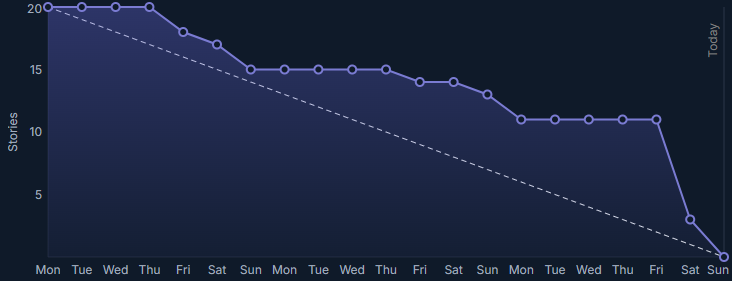

<h1 align="center">
:boar: EQUIPE JAVALI :boar:  

APRENDIZAGEM POR PROJETOS INTEGRADOS  

Sprint 3
</h1>

<h1 align="center"> :keyboard: :keyboard: </h1>

## :mag_right: Índice

    <a href="#objetivo">Objetivo</a> | 
    <a href="#epicos">Épicos</a> |
    <a href="#backlog">Backlog</a> |
    <a href="#dor">DoR</a> |
    <a href="#dod">DoD</a> |
    <a href="#burndown">Burndown</a> |
    <a href="#mvp">MVP</a> 

## :dart: Objetivo da Sprint

    Nesta sprint, a equipe se compromete a entregar as funcionalidades de recuperação de senha, edição de perfil, desenvolvimento da API, aprimoramento do agente chatbot e melhorias na documentação, incluindo o manual de instalação e o manual do usuário, além de garantir maior disponibilidade por meio da hospedagem da aplicação na AWS, assegurando também a responsividade da interface para uma experiência otimizada em dispositivos móveis e computadores.

## :clipboard: Épicos
Abaixo estão os requisitos abordados nesta sprint:

→ [Voltar ao topo](#topo)

## :bookmark_tabs: Sprint Backlog

Abaixo está o backlog desta sprint:
| Rank | Prioridade |                                                              User Story                                                               | Estimativa | Requisto |                                                      DoD                                                                        |
|:----:|:----------:|:-------------------------------------------------------------------------------------------------------------------------------------:|:----------:|:--------:|:-------------------------------------------------------------------------------------------------------------------------------:|
|  17  |   Média    |                    Como cliente quero o sistema hospedado em nuvem para facilitamento de utilização e segurança.                      |     41     |  RNF-2   |                                Frontend e Backend rodando hospedado em numvem e se comunicando entre si                         |
|  18  |   Baixa    |            Como usuário quero que o sistema funcione tanto como um site, aplicativo e desktop para eu usar quando quiser.             |     32     |  RNF-1   |                                   Aplicação responsiva em várias aplicações como computador e celular                           |
|  19  |   Baixa    |                      Como desenvolvedor quero o ocultamento de dados sensíveis para a segurança dos meus dados.                       |     3      |   RF-1   |                                      Ocultamento de dados sensíveis no código, colocando-as no .env                             |
|  20  |   Baixa    |                  Como usuário quero recuperar minha senha para que quando eu esquecê-la eu não perder minha conta.                    |     7      |   RF-1   |                        Recuperação de senha pelo email, sendo que a senha esteja salva em segurança no banco de dados           |
|  21  |   Baixa    |                Como usuário quero alterar minha senha para eu ajusta-la de acordo com minha preferências e segurança.                 |     5      |   RF-1   | Possibilitar que o usuário altere sua própria senha na aplicação, sendo que a senha esteja salva em segurança no banco de dados |
|  22  |   Baixa    |                 Como usuário quero um manual de como utilizar o sistema para minha conveniência e agilização deste.                   |     3      |  RNF-3   |                               Manual de usuário que explique o funionamento da aplicação para o usuário                         |
|  23  |   Baixa    | Como desenvolvedor quero um manual de como instalar, configurar e executar o sistema para facilitar a sua implementação e manutenção. |     3      |  RNF-4   |                                        Manual de instalação explicando como instalar a aplicação                                |

- Meta da Sprint: 18, 19 e 20 
- Previsão da Sprint: 17, 21, 22, 23

→ [Voltar ao topo](#topo)

## :white_check_mark: DoR - Definition of Ready

    Só poderemos iniciar as tarefas desta sprint caso estejam prontos:

- Arquitetura do projeto  
- Modelo de dados  
- Wireframe

→ [Voltar ao topo](#topo)  

## :trophy: DoD - Definition of Done
Esta sprint só estará completa quando a equipe concluir:
- Hospedagens do back-end e do Web;
- Desenvolvimento da API do Agente IA;
- Responsividade da aplicação para WEB e mobile;
- Tela de Recuperar Senha;
- Tela de Perfil do Usuário;
- Manual de Instação;
- Manual do usuário, tanto a documentação, quanto a parte visual na aplicação.

→ [Voltar ao topo](#topo)

## :chart_with_downwards_trend: Burndown da Sprint
Abaixo está o fluxo de entregas desta sprint:

→ [Voltar ao topo](#topo)

## :rocket: MVP - Minimum Viable Product

    O produto mínimo viável desta sprint consiste na funcionalidade de recuperar senha. Além disso, o MVP contempla a implementação da responsividade do site, e na omissão de dados sensíveis da aplicação. Para visualizar o que foi desenvolvido no projeto, <a href="https://youtu.be/0mF5On5caEI">acesse aqui</a>. />

→ [Voltar ao topo](#topo) 
